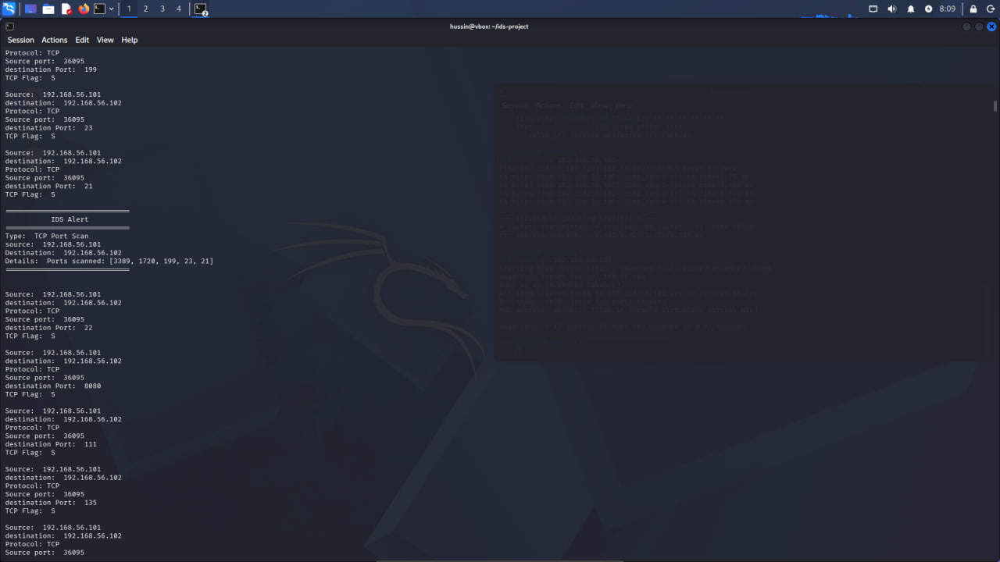
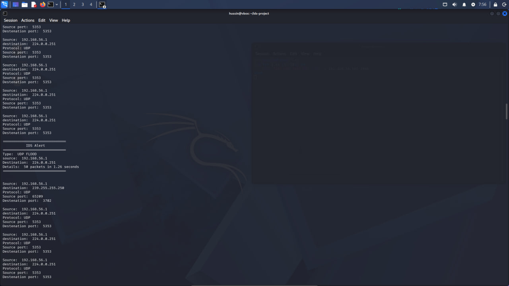
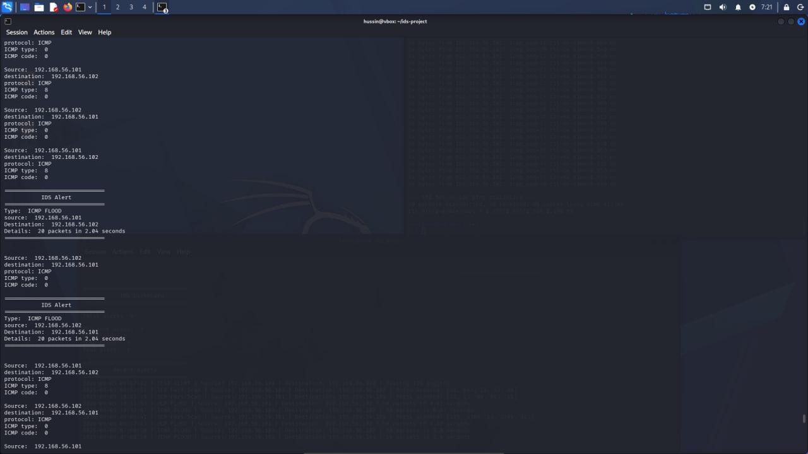

## Network Intrusion Detection System (IDS)

A Python-based Network Intrusion Detection System developed for a controlled virtual lab environment. The system uses Scapy to capture and analyze network packets and detect suspicious traffic patterns.

## Features

- UDP Flood Detection
- ICMP Flood Detection
- Real-time terminal alerts
- Alert logging
- Terminal-based IDS dashboard
- Centralized logging using a Python logger module

## Project Structure
ids/
├── ids.py
├── dashboard.py
├── logger.py
├── requirements.txt

## Detection Methods

TCP Port Scan
The IDS tracks TCP SYN packets from each source and monitors the number of different destination ports accessed within a time window.
UDP Flood
The IDS monitors the number of UDP packets received from a source within a defined time window.
ICMP Flood
The IDS monitors the number of ICMP packets received from a source within a defined time window.

## Installation

# clone the repository:
git clone YOUR_GITHUB_REPOSITORY_URL
cd ids

# install the required package:
pip install -r requirements.txt

# Running the IDS
Run the IDS with administrator/root privileges:
sudo python3 ids.py
(The network interface may need to be changed depending on the lab environment.)

# Running the Dashboard
In another terminal:
python3 dashboard.py
The dashboard reads the IDS log and displays detected alerts.

# Testing Environment
The IDS was tested in a controlled virtual machine lab environment.
Example lab addresses:
Kali Linux: 192.168.56.101
Target VM:  192.168.56.102

# Testing included:
- TCP port scanning
- Bounded UDP flood testing
- ICMP traffic testing

## Technologies
- Python
- Scapy
- Linux
- VirtualBox
- Networking
- Intrusion Detection Systems

## screenshots

# IDS Dashboard

1[IDS Dashboard](screenshots/Dashboard.png)

# TCP Port Scan Detection

# UDP Flood Detection

# ICMP Flood Detection

